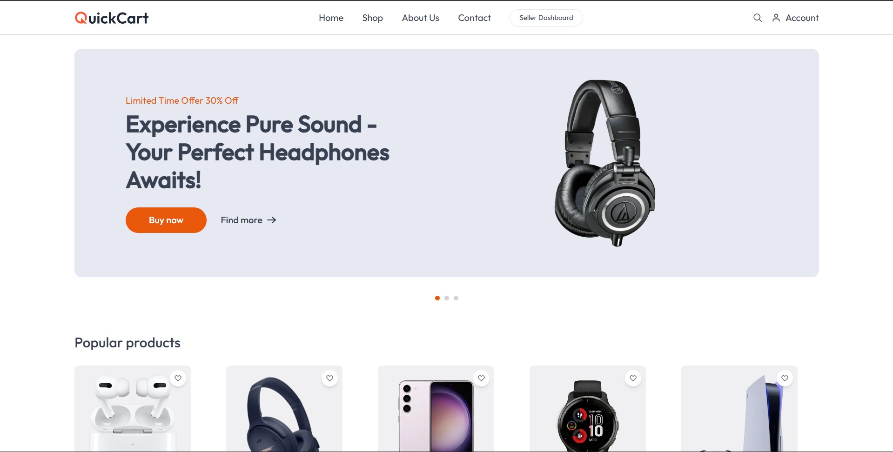

<div align="center">



# QuickCart

Modern e-commerce experience built with Next.js App Router, Tailwind CSS, and a lightweight global context for cart, checkout, and seller workflows.

</div>

## ✨ Highlights

- **Customer storefront** with curated hero slider, featured products, product detail views, and cart/order flows.
- **Seller dashboard** for listing products, monitoring orders, and managing fulfillment steps.
- **Responsive layout** powered by Tailwind CSS and reusable components (`Navbar`, `Footer`, `ProductCard`, etc.).
- **Context-based state** via `context/AppContext.jsx` for sharing cart data and UI state across the app.
- **Plug-and-play UI assets** stored under `assets/` for consistent iconography and imagery.

## 🛠️ Tech Stack

- [Next.js 14+ (App Router)](https://nextjs.org/docs/app)
- React server & client components
- Tailwind CSS
- Context API

## 🚀 Getting Started

### Prerequisites

- Node.js 18+ (LTS recommended)
- npm (bundled with Node) or your preferred package manager

### Installation

```bash
git clone <your-fork-or-repo-url>
cd QuickCart
npm install
```

### Local Development

```bash
npm run dev
```

Visit http://localhost:3000 to explore the storefront and seller views. Hot reloading is enabled out of the box.

### Production Build

```bash
npm run build
npm start
```

## 📁 Project Structure

```
QuickCart/
├─ app/               # App Router routes for storefront, cart, checkout, seller views
├─ components/        # Reusable UI blocks (customer + seller dashboards)
├─ assets/            # SVG/PNG assets referenced throughout the UI
├─ context/           # App-wide React context providers
├─ lib/               # Auth helpers and shared utilities
└─ public/            # Static files served by Next.js
```

## 🔧 Configuration

Environment variables can be added via `.env.local` if you connect real APIs (e.g., authentication, product service, payments). Add any required keys and restart the dev server.

## ✅ Scripts

| Script | Description |
| --- | --- |
| `npm run dev` | Start the local Next.js dev server |
| `npm run build` | Create an optimized production build |
| `npm start` | Run the built app with Node |

## 🤝 Contributing

1. Fork the repository.
2. Create a feature branch: `git checkout -b feature/amazing-feature`.
3. Commit your changes and open a pull request describing the motivation, screenshots, and testing steps.

## 📄 License

This project is provided for educational/demo purposes. Adapt or extend it for your own storefront needs.
